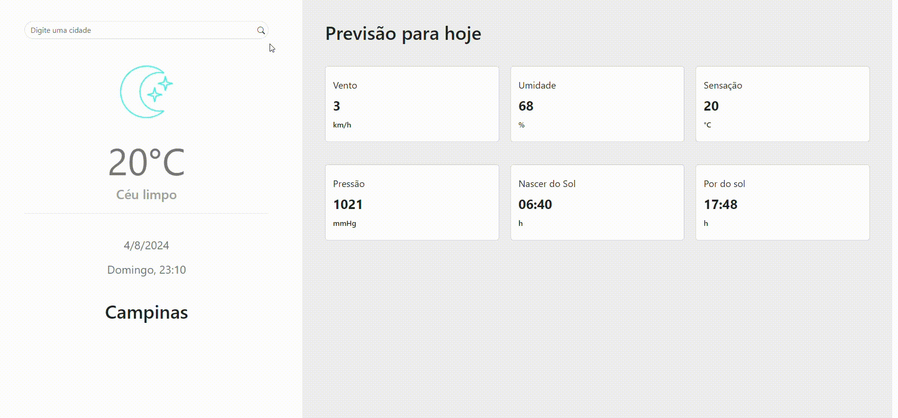

<h1 align="center">WeatherApp</h1>

## 💻 Sobre o projeto

<p>
O Weather App é um aplicativo Angular simples que permite aos usuários verificar a condição climática atual em diferentes cidades. Ele utiliza serviços de previsão do tempo (como a API OpenWeatherMap) para obter informações sobre o clima e exibir os dados relevantes para o usuário.
</p>

## Pré-visualização

Aqui está uma pré-visualização do projeto em execução:



### Pré-requisitos
- [NodeJS](https://nodejs.org/en/)
- [VSCode](https://code.visualstudio.com/)

## Funcionalidades
- Pesquisa de cidades: Os usuários podem inserir o nome de uma cidade e obter informações sobre o clima atual.
- Exibição de dados: O aplicativo exibe dados como temperatura, descrição do tempo, ícone representando o estado do tempo e outros detalhes relevantes.

## Tecnologias Utilizadas

O projeto foi desenvolvido utilizando as seguintes tecnologias:

- **[AngularCLI](https://angular.io/)**
- **[RxJS](https://rxjs.dev/)**
- **[API OpewWeatherMap](https://openweathermap.org/)**
- **[Ngx Skeleton Loader](https://www.npmjs.com/package/ngx-skeleton-loader)**


## Como Instalar e Executar

Primeiramente, faça um clone do repositório.

```bash
# clone o repositório
$ git clone https://github.com/WillianGiacomelli/WeatherApp
```

### - Inicialize o frontend

```bash
# entre no diretório
$ cd WeatherApp

# instale as dependências
$ npm install

# inicie o servidor
$ ng serve

# Acesse no seu navegador
$ http://localhost:4200
```

## Estrutura do Projeto
```shell
  src
  ├── core
  │   ├── models
  │   └── services
  │ 
  ├── features
  │  
  ├── pages
  │   ├── component
  │   ├── components
  │   └── services
  │
  └── shared
```

##  Observações

- Lembre-se de substituir a chave de api localizada em variaveis.
- Este é um projeto de exemplo e pode ser expandido com mais funcionalidades, como previsão do tempo para os próximos dias, histórico de pesquisas, etc.

## 📝 Licença

Este projeto esta sobe a licença [MIT](./LICENSE).

Feito por Willian Giacomelli 👋🏽 [Entre em contato!](https://www.linkedin.com/in/williangiacomelli/)
